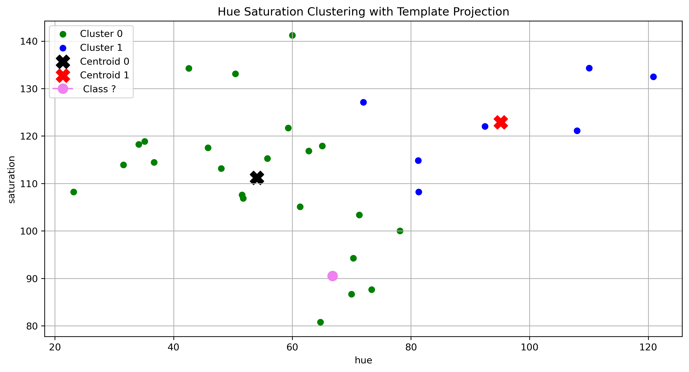
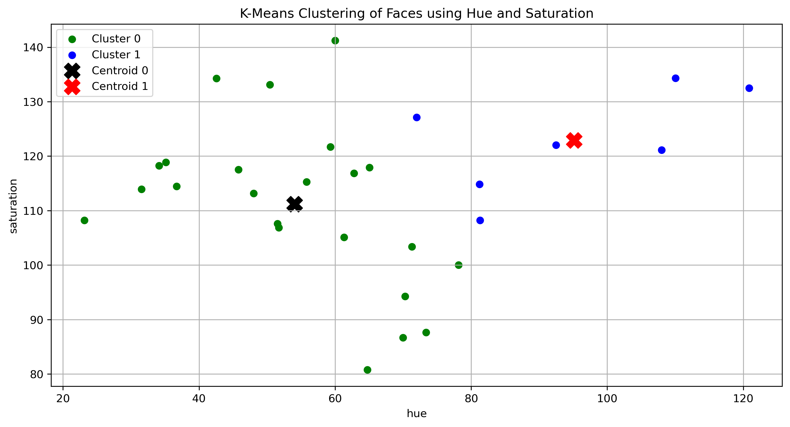
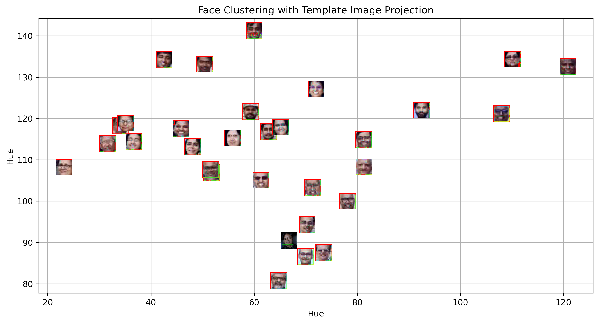
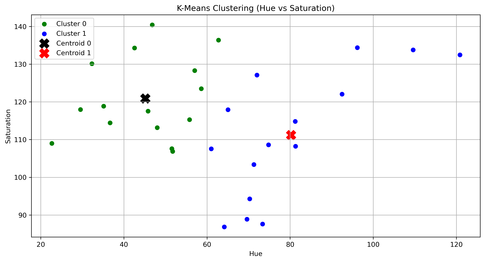
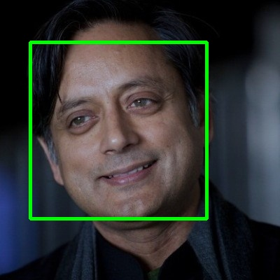

# machine_learning-face-clustering

<h1 align="center">Face Clustering using Distance-Based Classification</h1>

<h2>Overview</h2>

This project detects faces in an image and clusters them based on visual similarity using 
K-Means clustering. Colour-based features are extracted from detected faces and grouped 
using distance-based similarity measures.

<h2>Aim</h2>
<ul>
  <li>Detect faces using OpenCV Haar Cascade classifier</li>
  <li>Extract meaningful colour features from detected faces</li>
  <li>Apply K-Means clustering using distance-based similarity</li>
  <li>Visualize clustering results in feature space</li>
  <li>Classify a new template face into an existing cluster</li>
</ul>

<h2>Methodology</h2>

<h3>1. Face Detection</h3>

Haar Cascade classifier is used to detect faces in the image. 
Bounding boxes are drawn around detected faces.

<h3>2. Feature Extraction</h3>

Each detected face is converted from BGR to HSV colour space. 
Mean Hue and Saturation values are computed and used as a 2D feature vector 
to represent each face.

<h3>3. Clustering</h3>

K-Means clustering is applied on the extracted features. 
Faces are grouped based on distance similarity and cluster centroids are computed.

<h3>4. Template Classification</h3>

A new template face image is processed in the same way. 
Its features are extracted and the trained K-Means model predicts 
which cluster it belongs to.

<h3>5. Visualization</h3>

Scatter plots are used to visualize clusters, centroids, 
and template classification in feature space.

<h2>Visual Results</h2>

  
  

<em>Original Image vs Detected Faces</em>

  
  

<h2>Key Findings</h2>
<ul>
  <li>Distance-based similarity effectively groups visually similar faces</li>
  <li>Hue and Saturation features provide meaningful clustering representation</li>
  <li>K-Means successfully separates faces into distinct groups</li>
  <li>Template image can be classified into one of the clusters</li>
</ul>

<h2>Conclusion</h2>

This project demonstrates how distance-based clustering techniques can be applied 
to computer vision problems. By combining face detection, feature extraction, 
clustering, and visualization, the system successfully groups similar faces 
and classifies new inputs.

The experiment highlights the importance of feature selection, 
distance metrics, and visualization in understanding machine learning behaviour.

